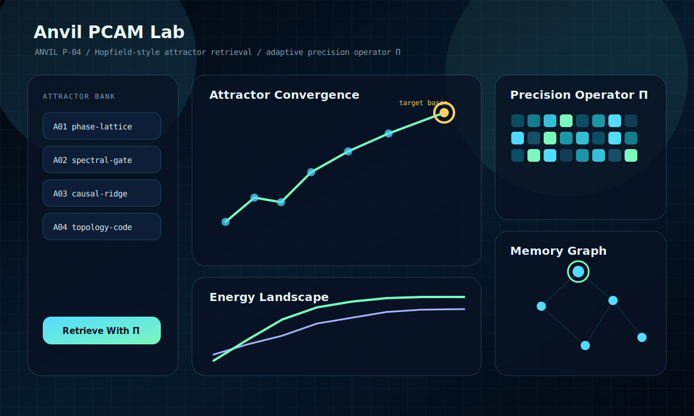
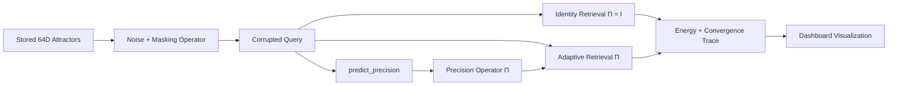

# Anvil PCAM Lab

Anvil PCAM Lab is an interactive ANVIL P-04 research prototype for **precision-controlled associative memory retrieval**. It demonstrates how a noisy 64-dimensional cue can be steered toward a stored memory attractor with modern Hopfield-style dynamics, an adaptive diagonal precision operator `Π`, and energy-based convergence traces.



## Research Idea

The system stores `K` normalized memory attractors:

```text
X = {x_1, x_2, ..., x_K},  x_i in R^64
```

A selected attractor is corrupted with masking and Gaussian noise. Retrieval then compares two inference-time regimes:

```text
baseline:          Π = I
adaptive Anvil:    Π = diag(p),  p in R^64, p_j > 0, mean(p) = 1
```

The adaptive precision vector changes the geometry of the basin by scaling dimensions independently. High-confidence coordinates exert stronger pull; noisy or outlier coordinates are damped before they can dominate the Hopfield update.

## Architecture



Core modules:

- `anvil_pcam/core/memory.py`: deterministic 64D attractor bank and similarity graph.
- `anvil_pcam/core/noise.py`: masking plus Gaussian corruption simulation.
- `anvil_pcam/core/precision.py`: exact `predict_precision(corrupted_query)` interface.
- `anvil_pcam/core/dynamics.py`: modern Hopfield-style iterative retrieval and energy traces.
- `anvil_pcam/core/evaluation.py`: baseline/adaptive comparison metrics.
- `anvil_pcam/web/`: thin FastAPI dashboard for the interactive demo.

## Precision Interface

Anvil PCAM Lab exposes the required inference-time precision predictor:

```python
def predict_precision(corrupted_query):
    """
    corrupted_query : ndarray (64,)
    returns         : ndarray (64,) positive precision values
    """
```

The implementation guarantees:

- output shape is `(64,)`
- all values are strictly positive
- values are clipped to `[0.1, 10.0]`
- mean precision is normalized to `1`

The heuristic uses similarity to stored attractors, local attractor variance, residual/outlier estimates, and basin stiffness. Precision genuinely affects both the attention scores and the anisotropic update rate during retrieval.

## Retrieval Dynamics

At each step, the retrieval engine computes precision-weighted attractor scores:

```text
s_i = x_i^T Π ξ_t
a = softmax(β s)
c_t = normalize(a^T X)
```

The state update is anisotropic:

```text
ξ_{t+1,j} = normalize(ξ_t + α_j (c_t - ξ_t))
α_j ∝ sqrt(Π_jj)
```

The dashboard visualizes:

- 64-value precision heatmap
- noisy query vector strip
- attractor convergence trajectory
- energy landscape curve
- memory attractor graph
- baseline `Π = I` vs adaptive `Π` metrics

## Demo Flow

1. Select a stored memory attractor.
2. Inject heavy noise with Gaussian corruption and coordinate masking.
3. Generate the adaptive precision vector `Π`.
4. Run identity-precision retrieval and adaptive-precision retrieval.
5. Animate convergence toward the attractor basin.
6. Compare convergence speed, target cosine, stability, and anisotropy.

## Run Locally

```bash
pip install -e ".[dev]"
anvil-pcam serve --port 8420
```

Open `http://127.0.0.1:8420`.

Command-line trial:

```bash
anvil-pcam demo --pattern A03 --sigma 0.58 --mask 0.28
```

Bank-level robustness check:

```bash
anvil-pcam benchmark
```

Docker:

```bash
docker compose up --build
```

## API

```text
GET  /api/pcam/state
POST /api/pcam/trial
POST /api/pcam/precision
GET  /api/pcam/benchmark
```

Example trial request:

```bash
curl -X POST http://127.0.0.1:8420/api/pcam/trial \
  -H 'Content-Type: application/json' \
  -d '{"pattern_id":"A03","gaussian_sigma":0.58,"mask_fraction":0.28,"seed":2404}'
```

## Design Intent

Anvil PCAM Lab is intentionally not a storage product. It is a compact systems prototype for studying associative retrieval under inference-time precision steering. The code favors inspectable numerical mechanisms, deterministic demos, and visual intuition over scale-oriented infrastructure.
